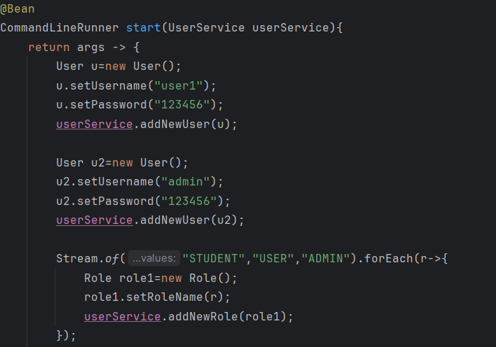

<h3>Compte rendu<h3>

<h4>1-Les dépendances JPA, H2, Spring Web, Lombock et Mysql</h4>

<h4>2 -L'entité User :</h4>

<h4>- L'entité Role :</h4>

<h4>- Chaque user peut avoir un ou plusieur role,et un role peut etre contribuer a un ou plusieurs users c'pour cela on mit une association ManyToMany</h4>
<h4>- FetchType.EAGUER signifie si on demande a Spring de creer un user, il va creer un role en meme temps</h4>

<h4>3-L'application.properties </h4>

<h4>- Dans la couche service, on declare des methodes dans l'interface UserService :</h4>

<h4>- Les deux methodes pour ajouter un user et un role </h4>

<h4>- La methode pour ajouter un role a un user</h4>

<h4>- La methode pour s'authentifier</h4>

<h4>- L'utilisation des methodes dans JpaEnsetApplication :</h4>

<h4>Ajouter un utilisateur et un role :</h4>

<h4>Ajouter un role a un user :</h4>

<h4>S'authentifier :</h4>

